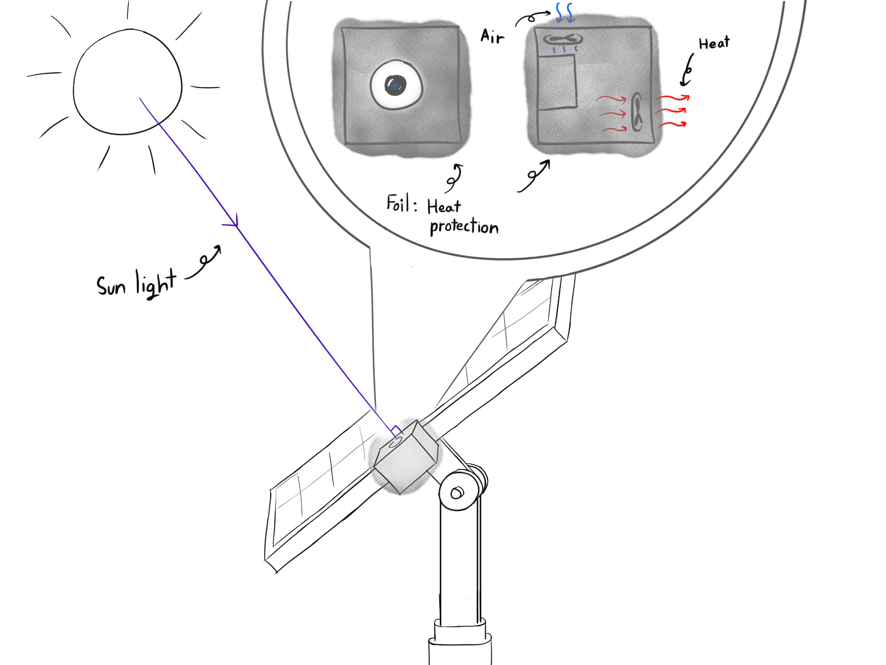

# CPE-414 Solar Cell Positon Detector

  
  <h1>Solar Cell Postion Detector</h1>
  
  
RTOS Project With Raspberry Pi 5 & Deep Learning

<!-- TABLE OF CONTENTS -->

  
Table of Contents

  <ol>
    <li>
      <a href="#about-the-project">About The Project</a>
      <ul>
        <li><a href="#built-with">Built With</a></li>
      </ul>
    </li>
    <li>
      <a href="#getting-started">Getting Started</a>
      <ul>
        <li><a href="#prerequisites">Prerequisites</a></li>
        <li><a href="#installation">Installation</a></li>
      </ul>
    </li>
    <li><a href="#usage">Usage</a></li>
    <li><a href="#roadmap">Roadmap</a></li>
    <li><a href="#contributing">Contributing</a></li>
    <li><a href="#license">License</a></li>
    <li><a href="#contact">Contact</a></li>
    <li><a href="#acknowledgments">Acknowledgments</a></li>
  </ol>

<!-- ABOUT THE PROJECT -->
## About The Project

### 🌞 Overview  
The Solar Cell Position Detector is an intelligent sun-tracking system designed to maximize solar energy efficiency by dynamically adjusting the position of a solar panel based on the real-time position of the sun. This project integrates Deep Learning, Computer Vision, and Servo Motor Control on a Raspberry Pi 5 to continuously track the sun and reposition the solar panel accordingly.
### 🔍 How It Works
